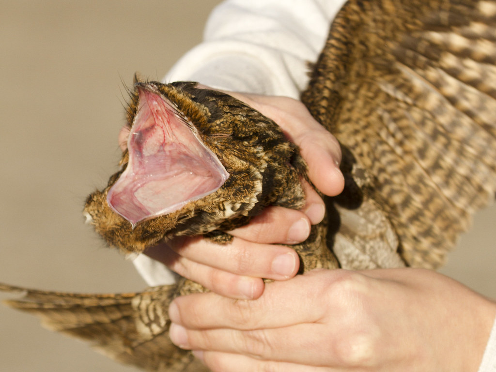

```{r setup, include=FALSE}
knitr::opts_chunk$set(echo = TRUE)

library(tidyverse)  
library(ggplot2)
library(dplyr)
library(tidyr)
library(knitr)      
library(leaflet)
library(hexbin)
library(readxl)

```

# I. Study Area

```{r map, echo=FALSE, include=TRUE}

leaflet() %>%
  setView(-87.556445, 36.577227, zoom = 11) %>%
  addTiles() %>%
  addMarkers(-87.556445, 36.577227, popup = "Study Site")

```

[Figure 1: Study area located at Fort Campbell, Kentucky.]{style="color:red"}

# II. Data Tables

```{r table1, echo=FALSE, include=TRUE}

control_numbers <- read.csv("bats_by_species.csv")

kable(control_numbers[1:14, ], caption = 'Table 1. Number of bat calls detected by species over the trial period, treatment week beginning on 6/9/2023.')

```

```{r table 2, echo=FALSE, include=TRUE}

abiotic_data <- read_xlsx("abiotic_data.xlsx")

kable(abiotic_data[1:14, ], caption = 'Table 2. Abiotic factors possibly affecting bat foraging presence.')

```

# III. Plots

```{r plot1, echo=FALSE, include=TRUE}

bats <- read.csv("bat_raw_numbers.csv")

plot1 <- ggplot(data = bats, aes(x = date, y = bat_calls)) +
  geom_point() +
  geom_line() +
  xlab("Date") +
  ylab("Number of Detected Calls") +
  theme_bw()
plot1

```

[Figure 2: Number of bat calls detected per night over the entire 2 week trial period]{style="color:red"}

```{r plot2, echo=FALSE, include=TRUE}

plot2 <- ggplot(abiotic_data, aes(x = week, y = bat_calls)) +
  geom_boxplot() +
  theme_bw()
plot2

```

[Figure 3: Number of bat calls detected during control week compared to number detected during treatment week]{style="color:red"}

# IV. Statistical Analysis

```{r stats ttest, echo=FALSE, include=TRUE}

t.test(bat_calls ~ week, data = abiotic_data)

```

```{r stats ANOVA, echo=FALSE, include=TRUE}

model1 <- lm(bat_calls ~ moon_lum, data = abiotic_data)
anova(model1)

```

# V. Study Species


[Figure 4. The Eastern red bat (*Lasiurus borealis*)]{style="color:red"}


[Figure 5. The tricolored bat (*Perimyotis subflavus*)]{style="color:red"}



[Figure 6. The Chuck-Wills-Widow, a possible bat predator (*Antrostomus carolinensis*)]{style="color:red"}

<font size = "5">[Now let's watch an example of predation on bats!]{style="color:red"}</font>

<iframe width="610" height="348" src="https://www.youtube.com/embed/UROVfmY3NTA" data-external="1">

</iframe>